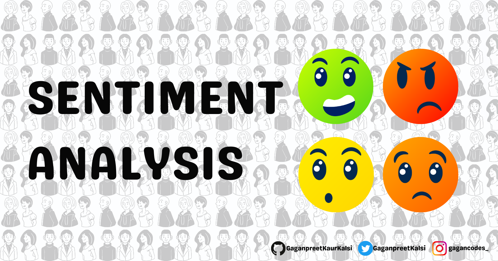

# PySentimento: Toolkit para multitarefas para análise de sentimentos e SocialNLP

O PySentimento é uma biblioteca Python que foi desenvolvida para análise de sentimentos em textos. Ela permite ao usúario identificar e determinar se o sentimento expresso é positivo, negativo ou neutro.  O PySentimento é útil em avaliação de opniões de produtos ou serviços, em tarefas de análise de sentimento em redes sociais etc.

